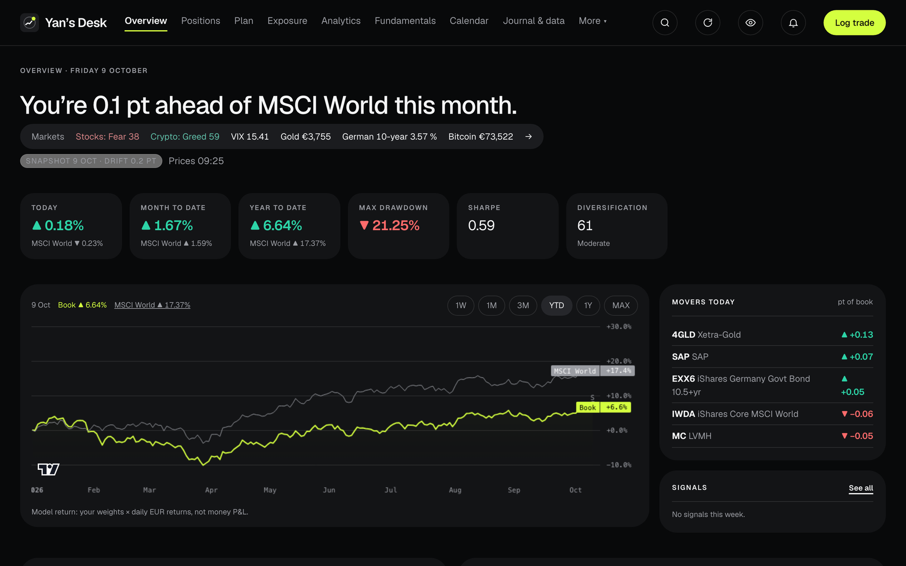
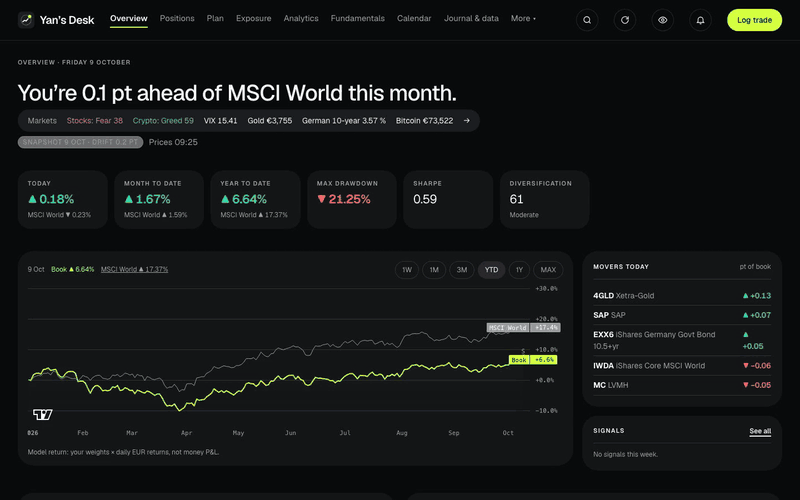
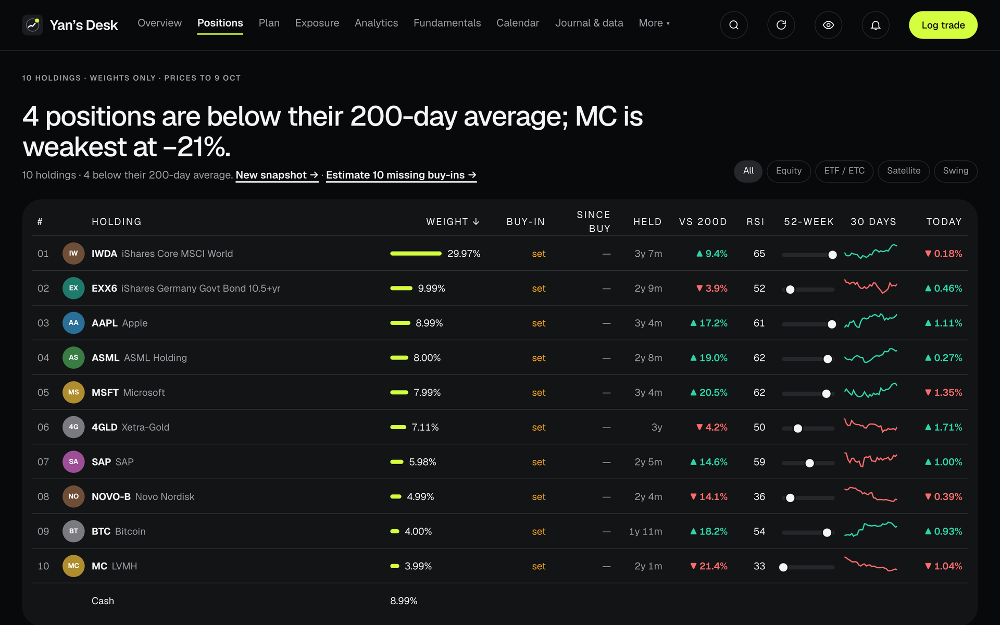
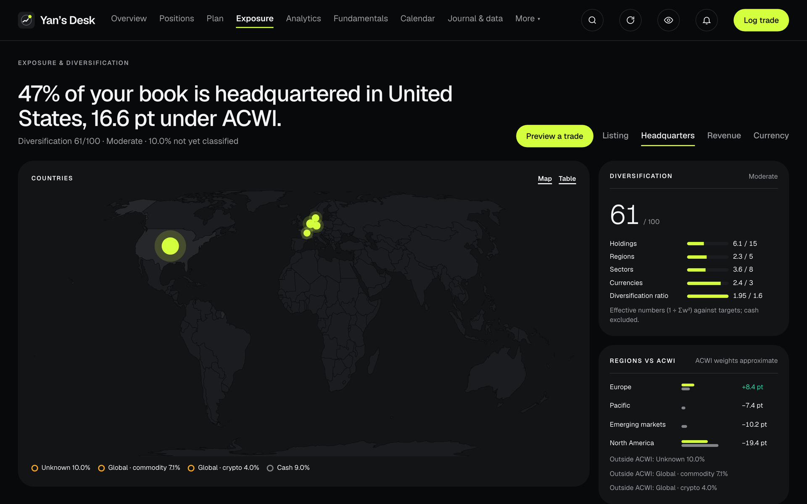
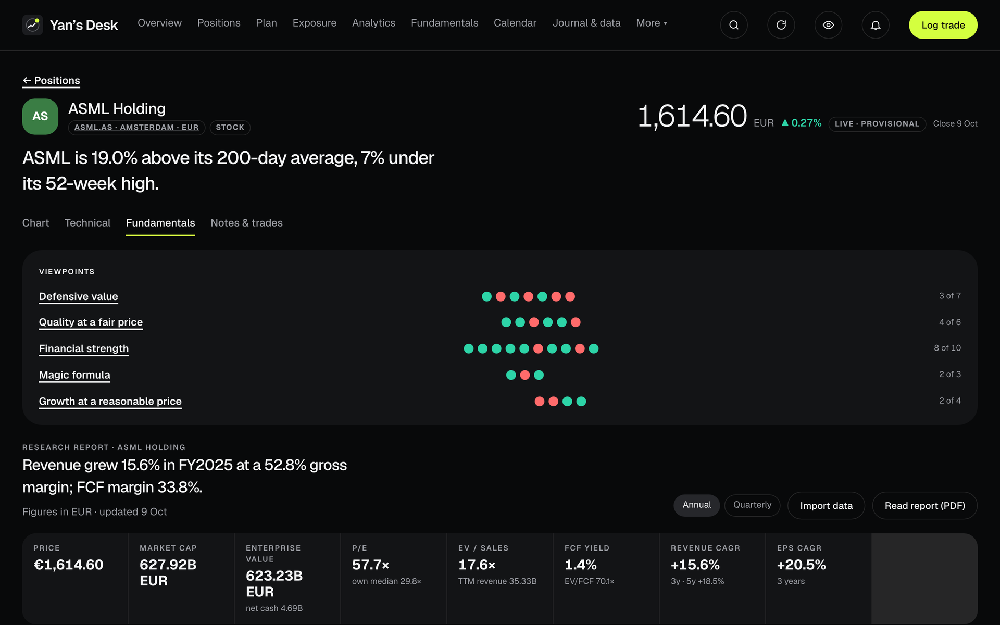
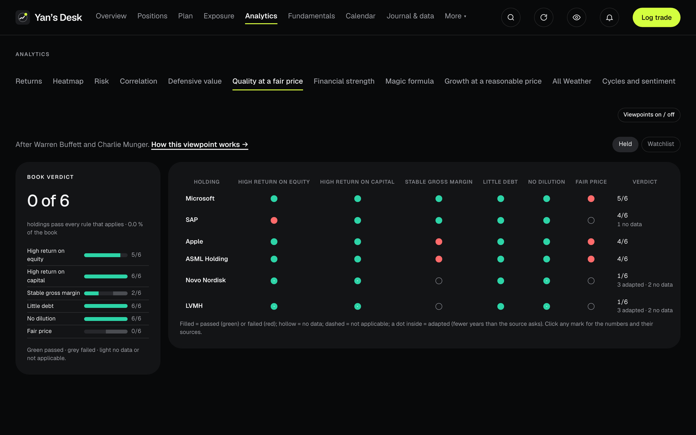
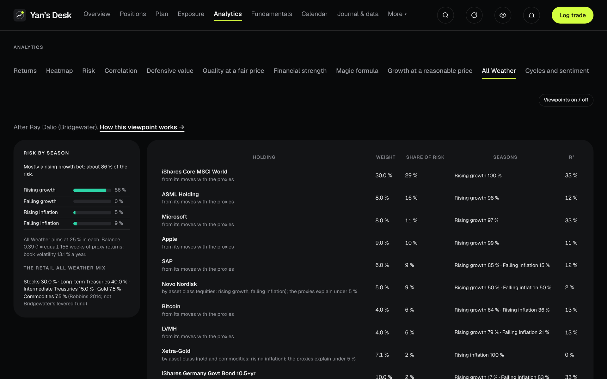
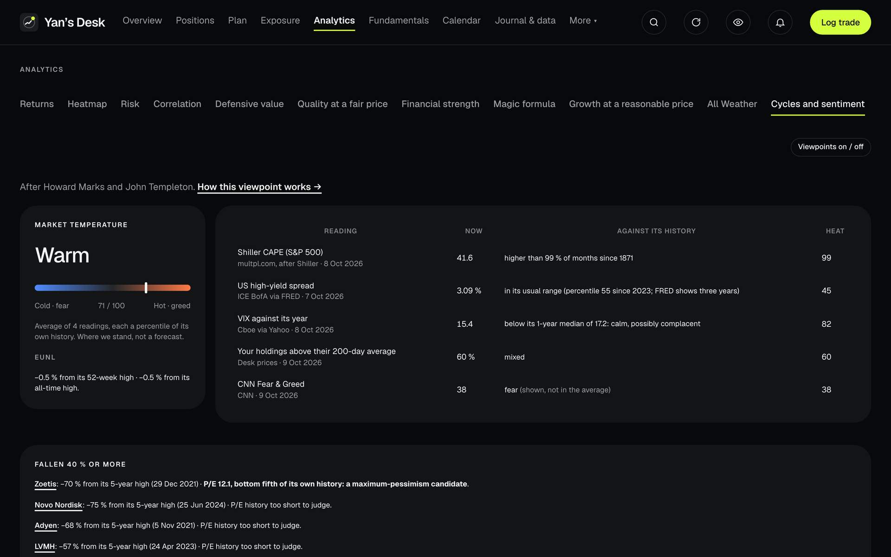
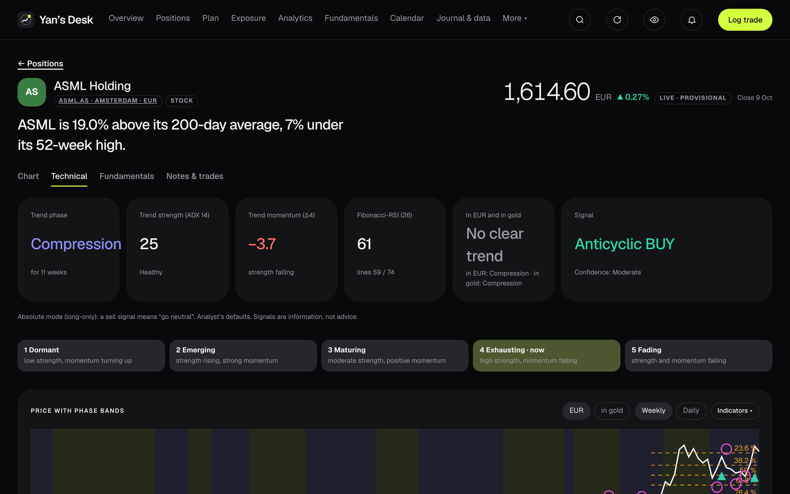
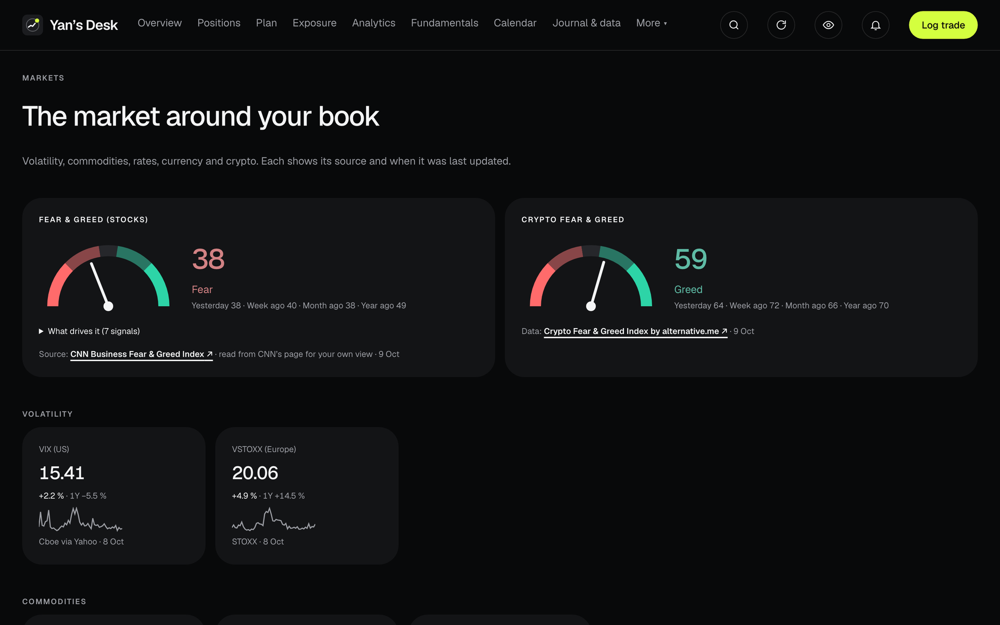

# Desk

**A private portfolio desk that runs on your own computer.** See your whole book, how it's really doing against the index you could have bought instead, what it's exposed to, what the economy and markets around it are doing, and what the great investors' rules would say about each holding, or about any company you're looking at. No account, no cloud, no subscription. Your data never leaves your machine.

Desk in 40 seconds (<a href="assets/desk-explainer.mp4">full-quality video</a>). All screens show a demo book.

**[⬇ Download the latest version](https://github.com/yannalbrecht/desk-releases/releases/latest)** · Mac (Apple Silicon and Intel, signed by Apple) and Windows · updates itself

The real app, a one-minute tour (<a href="assets/desk-tour.mp4">full-quality video</a>).

---

## What it does

### Your book, honestly measured
- **Overview** opens with a **Briefing**: a few lines on what changed since you last looked and what needs attention, from your return against your benchmark (MSCI World by default, or your own blend) to big moves with their context ("its biggest drop since March"), results and dividends this week, and trend changes. Pick since you last looked, today, this week or this month.
- **Your widgets** below it, arranged the way iPhone home-screen widgets are: 27 of them (returns, contributors, drawdown, allocation, regions, risk share, fear & greed, macro regime, signals, calendar and more) in small, medium and large sizes. Edit, drag, resize, stack, and keep one layout for your computer and one for your phone. Each widget is a chart with one short line that says what it shows.
- **Positions** shows every holding with its weight, distance from the 200-day average, RSI, 52-week range and a 30-day sparkline. The default sort is by weight, not by gain, because ranking by gain nudges you to sell your best and worst names.
- **Import from Trade Republic** (exact weights, average cost with fees, real buy dates), or set it up by hand with any broker. Crypto (Bitcoin, Ether and more) counts as a holding, priced in euros.
- **Privacy switch** (the eye) hides every amount at a glance.

### What you're really exposed to
- **Exposure** by country of listing, headquarters, revenue or currency, with ETFs looked through to their holdings, a diversification score and your regions against the world index.
- **Preview a trade** before you make it: exposure, risk share and concentration, before and after.

### Analytics
- **Returns** against MSCI World, the S&P 500 or your own blend; monthly heatmap; **risk** (drawdown, risk contribution per holding); **correlation** clusters.
- **Charts** from the last 24 hours (5-minute bars, refreshing every 30 seconds) to the full history, or any dates you pick, with your buy levels, stops and trades drawn on.
- **Fundamentals** for every stock: revenue, margins, cash flow and balance sheet from the companies' own filings (SEC EDGAR for US companies, ESEF annual reports for European ones), annual, half-year and quarterly. Upload a quarterly report (PDF) and Desk reads its figures.

### Viewpoints: the great investors' rules, applied to your holdings
All are on from the start; switch off the ones you don't want. Each checks every holding rule by rule with the number used and a link to its source, and comes with an explainer: who it's from, what it checks, how to read it, and where it falls short.

| Viewpoint | After | What it checks |
|---|---|---|
| **Defensive value** | Benjamin Graham | Graham's seven criteria for the defensive investor, the Graham number and margin of safety |
| **Quality at a fair price** | Warren Buffett and Charlie Munger | Returns on equity and capital, margin stability, debt, dilution, owner-earnings yield against the bond |
| **Financial strength** | Joseph Piotroski and Edward Altman | The nine-point F-Score and the Altman Z distress zones |
| **Magic formula** | Joel Greenblatt | Earnings yield and return on capital, ranked across what you hold and watch |
| **Growth at a reasonable price** | Peter Lynch | Lynch's six company categories, PEG and the dividend-adjusted ratio |
| **All Weather** | Ray Dalio | Which economic seasons your book's risk depends on, against equal risk in each |
| **Cycles and sentiment** | Howard Marks and John Templeton | Where the market stands against its own history (CAPE, credit spreads, VIX, breadth), and fallen stocks at the bottom of their own valuation |
| **Passive core** | John C. Bogle | What your funds cost, where they overlap, and whether your picks beat the index |
| **Technical** | RealValue Trend Phase Framework | Trend phase first, then the tools that suit it; also measured in gold |

### Markets: the weather around your book
- **Six regime chips** sum up the macro picture in a word each (growth, inflation, rates and the yield curve, credit, liquidity and risk appetite), for the **euro area or the US**.
- **Rates & central banks:** yield curves today against a year ago, the 10-year minus 2-year spread, and ECB and Fed policy rates.
- **Inflation, growth and jobs:** core inflation against the 2 % target, US activity, unemployment with the Sahm rule, and two recession probabilities kept apart (a published one and one from the yield curve).
- **Credit & liquidity:** a financial-stress gauge, credit spreads within their five-year range, and Fed net liquidity.
- **Mood:** Fear & Greed for stocks (CNN, with its seven drivers) and crypto, plus VIX and VSTOXX, gold in euros, silver, Brent, Shiller's CAPE, EUR/USD, Bitcoin and Ether.
- All from official free sources (FRED, the ECB, the Bundesbank), each with its source and date; nothing stale is shown as current.

### Research: find, understand, decide
- **Search any company** by name or ticker. It opens on a research page without being added to your book.
- **One research page per company, in seven steps** with a rail to jump between them: snapshot, financials and quality (ten years of figures, F-Score, Altman Z), valuation against its own history, its industry and analysts' targets, industry and peers, ownership, results and dividends, and the viewpoint verdicts with their rules. **Watch**, add a **plan level** or set **alerts** from anywhere on the page, without leaving it.
- **Its five main competitors, picked for you:** the largest companies in the same industry and line of business, fetched on their own the first time you open a company. See where it ranks on margin, return on capital, growth, P/E, free-cash-flow yield and F-Score, side by side, and add, remove or re-pick competitors.
- **Your thesis** next to the verdicts: why you'd own it, what would prove you wrong, a fair-value range and a date to look again.
- **Industries and Ideas:** about 3,300 US companies from SEC filings, ranked by revenue in 94 industries, each with its leaders, margins and your own names marked. Preset ideas (margin leaders, steady earners, the largest company in each industry where you hold nothing) and a **screener** that tells you which filter removed the most names and why each match qualified.

### Plan, watchlist and alerts
Buy levels and zones, accumulation ladders, a swing book with stops and targets, and a watchlist that shows each name's viewpoint scores. Desk notifies you when a price reaches a level, a holding breaks a rule you set, or the data behind a number changes.

### Data you can trust
- A nightly **Data check** compares sources, flags figures that disappear, and spots periods where results are out but figures haven't arrived.
- **Data reports** keep 90 days of checks. Share an anonymised copy for support: it names no holdings, ISINs or amounts.
- Every number links to where it came from.

### Ask Claude (optional, off by default)
Let an AI assistant read your Desk at the level you choose (market data only, weights, or everything) through MCP, with setup for Claude Desktop and Claude Code.

---

## Download

Go to **[Latest release](https://github.com/yannalbrecht/desk-releases/releases/latest)** and, under **Assets**, download the one file for your computer:

| Your computer | Download | |
|---|---|---|
| **Mac with Apple Silicon** (M1, M2, M3, M4 …) | `Desk-<version>-arm64.dmg` | Most Macs from late 2020 on |
| **Mac with Intel** | `Desk-<version>.dmg` (no "arm64" in the name) | Older Macs |
| **Windows 10 / 11** | `Desk-Setup-<version>.exe` | |

You don't need the `.zip`, `.blockmap` or `.yml` files; Desk uses those to update itself.

**Which Mac do I have?** Apple menu  → **About This Mac**. If it says **Chip: Apple M…**, take the `arm64` file. If it says **Processor: … Intel …**, take the other `.dmg`.

## Install

**Mac:** open the `.dmg`, drag **Desk** into **Applications**, open it. Desk is signed and notarised by Apple, so it opens like any other app.

**Windows:** run the `.exe`. If Windows shows "Windows protected your PC", click **More info → Run anyway** (the Windows installer isn't certificate-signed yet; this happens once).

## First start

Choose **Import from Trade Republic**. Desk shows step by step how to export your transactions in the Trade Republic app (Profile → Account statements → Transaction export). Or set it up by hand with any broker, or restore a Desk backup.

## Updates

Automatic. Desk checks when it starts, every 30 minutes and when you come back to it, and downloads a new version straight away. A banner at the top of the app then counts down and restarts Desk into the new version, with **Restart now** or **Later** (Later installs it the next time you quit). Your data is never touched by an update.

**Coming from 0.3.8?** That version can't start, so it can't update itself: download the latest release once and drag it into Applications (Mac) or run the installer (Windows). From then on Desk updates on its own.

---

## License

Free to use for yourself. No redistribution, modification or reuse of any part of Desk without written permission. See [LICENSE](LICENSE.md); for anything beyond personal use, [send a licensing request](https://github.com/yannalbrecht/desk-releases/issues/new?title=Licensing%20request).

---

Desk shows information, not investment advice. Market data comes from free public sources (SEC EDGAR and its XBRL frames, ESEF filings, the ECB, the Bundesbank, FRED, Damodaran Online, Yahoo Finance and others), each named where it's used. Screenshots show a demo portfolio.
